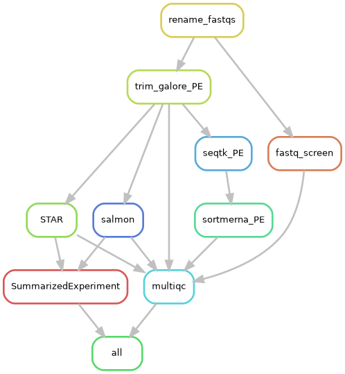
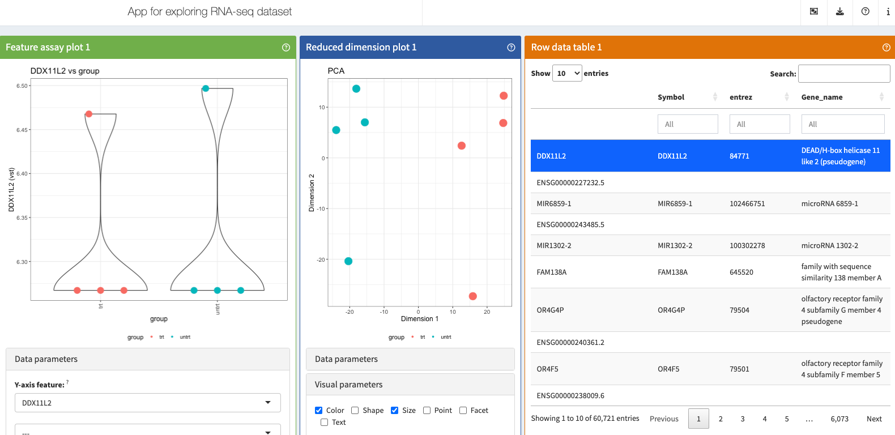

# **Basic RNA-Seq Analysis -- From fastq files to DE genes**

## **Run the BBC pipeline to align the reads**

### **The workflow as a graph**



### **Clone the Github repo**

Instructions for running it are on the [Github README](https://github.com/vari-bbc/rnaseq_workflow), but here we will go through each step in more detail.

```{bash, eval=FALSE, engine="sh"}
cd /varidata/researchtemp/hpctmp/BBC_workshop_June2023_II/

mkdir <username>

cd <username>
```

```{bash, eval=FALSE, engine="sh"}
git clone https://github.com/vari-bbc/rnaseq_workflow.git 

```

The Github repository consisting of the RNA-seq workflow should now be downloaded in a folder named `rnaseq_workflow`.

```{bash, eval=FALSE, engine="sh"}
cd rnaseq_workflow

ls
```

### **Add your fastq files to `raw_data/`**

Instead of making multiple copies of the same file, which can quickly use up your lab's storage quota, we can use **symbolic links**. The sequence data that we will be using for this workshop are from the [airway dataset](https://pubmed.ncbi.nlm.nih.gov/24926665/) referenced in the DESeq2 vignette. The gene counts can actually be downloaded as an [R package](https://bioconductor.org/packages/release/data/experiment/html/airway.html).

```{bash, eval=FALSE, engine="sh"}
ls ../../0_fastqs/
```

```{bash, eval=FALSE, engine="sh"}
ln -sr ../../0_fastqs/* ./raw_data
```

You can see where the symbolic links are pointing to using `ls -l`.

```{bash, eval=FALSE, engine="sh"}
ls -l ./raw_data
```

### **Fill out the samplesheet**

The samplesheet is a tab-delimited file within `config/samplesheet/` and is named `units.tsv`. The easiest way to fill this out is to run the helper script, `make_units_template.sh`, to generate a template, then edit using a text editor.

FOR THIS WORKSHOP, NO CHANGES NEED TO BE MADE.

```{bash, eval=FALSE, engine="sh"}
cd config/samplesheet/

./make_units_template.sh
```

There should now be a file named 'units_template.tsv'.

```{bash, eval=FALSE, engine="sh"}
ls
```

We can replace the 'units.tsv' with 'units_template.tsv'.

```{bash, eval=FALSE, engine="sh"}
mv units_template.tsv units.tsv
```

Go back to the base level of the project directory.

```{bash, eval=FALSE, engine="sh"}
cd ../..
```

Make sure you are at `/varidata/researchtemp/hpctmp/BBC_workshop_June2023_II/<username>/rnaseq_workflow`.

```{bash, eval=FALSE, engine="sh"}
pwd 

```

### **Fill out the config file**

The config file is a [YAML](https://en.wikipedia.org/wiki/YAML) file indicating the locations of reference files and also contains options for the workflow that you can turn off or turn on.

Typically, the main thing is to specify reference files corresponding to the species you have sequenced (human, mouse, or rat etc). For this workshop, we are dealing with human data so we will align to the hg38 reference.

Index files allow alignment algorithms to align reads to specific reference sequences.

FOR THIS WORKSHOP, NO CHANGES NEED TO BE MADE.

```{bash, eval=FALSE, engine="sh"}

cat config/config.yaml
```

### **Submit the main Snakemake job**

```{bash, eval=FALSE, engine="sh"}
sbatch -p big bin/run_snake.sh
```

### **BBC-maintained reference files**

For future reference, the BBC downloads and maintains commonly used files and indexes for several model species. These files are version controlled to promote reproducibility in case you need to rerun an analysis or you want to run the exact same analysis on different datasets.

```{bash, eval=TRUE, engine="sh"}
ls /varidata/research/projects/bbc/versioned_references/
```

```{bash, eval=TRUE, engine="sh"}
ls /varidata/research/projects/bbc/versioned_references/2023-05-03_15.28.41_v12/data/
```

The source of these files can be found in the `species.tsv` file.

```{bash, eval=TRUE, engine="sh"}
cat /varidata/research/projects/bbc/versioned_references/2023-05-03_15.28.41_v12/bin/species.tsv  | cut -f2-3
```

The versions of the software used to generate the index files can be found in the `config.yaml` file. Sometimes index files are not backwards-compatible, meaning index files generated by a newer version of a tool cannot be used by an older version of the tool.

```{bash, eval=TRUE, engine="sh"}
cat /varidata/research/projects/bbc/versioned_references/2023-05-03_15.28.41_v12/bin/config.yaml
```

## **Quality control**

It's important to look through QC metrics to ensure that the data is likely to produce meaningful results. Ideally, you don't want to waste time trying to interpret bad data.

### **multiQC report**

Navigate to your project folder using Finder (Mac) or File Explorer (Windows). Find `results/multiqc/multiqc_report.html` and double-click it.

* Alignment rate?
* Higher duplication rate can be normal for RNA-seq.
* Strandedness; In our workflow, this is automatically inferred using Salmon.
* Any contamination? Check FastqScreen results.

### **Other considerations**

* Not a bad idea to look quickly at the alignments in IGV. Any sign of gDNA contamination?
* Mutations in specific genotypes? Is it exonic? Can do a quick check in IGV.
* How many genes expressed? Easy to check in R.
* Marker genes? Can do a quick check in iSEE if you expect certain expression patterns between groups.
* Any genes supposed to knocked out or knocked down? Use iSEE.
* Does the PCA show clustering? Use iSEE.

## **Exploring the data using iSEE**

Navigate to your project folder using Finder (Mac) or File Explorer (Windows). Find `iSEE/app.R` and double-click it.



## **DE analysis using R and DESeq2**

### **Make an output directory**

```{r make_outdir, eval=FALSE}

outdir <- "./deseq2_out_files/"

dir.create(outdir, recursive=TRUE)
```

### **Load packages**

```{r load_pkges}
suppressMessages(library(dplyr))
library(stringr)
library(ggplot2)
library(readr)
library(ggrepel)
suppressMessages(library(ComplexHeatmap))
suppressMessages(library(DESeq2))
```

### **Set up your DESeq object**

```{r read_se, eval=FALSE}
se <- readRDS("../results/SummarizedExperiment/SummarizedExperiment.rds")
```

```{r read_se_for_rendering, eval=TRUE, echo=FALSE}
se <- readRDS("SummarizedExperiment.rds")

```

Let's take a look to see what assays are stored in the SummarizedExperiment object. Note that DESeq2 assumes the first assay is the raw counts.

```{r check_assays}
assayNames(se)

stopifnot(assayNames(se)[1] == "counts")
```

To print more information about this SummarizedExperiment object, you can just type its name.

```{r look_se}
se
```

The counts and the meta data need to be stored inside a special DESeq2 object called a 'DESeqDataSet'. Here, we also specify that each gene will be fit with a model design of '~ group'.

```{r make_dds}
dds <- DESeqDataSet(se, design = ~ group)
```

### **Remove genes with low/no expression**

We cannot do meaningful analyses of genes with very low counts. This will speed up the analysis.

```{r filter_low_genes}
# prefilter genes, keeping only genes with 10 or more total read counts across samples
keep <- rowSums(counts(dds)) >= 10

message(str_glue("Keeping {sum(keep)} genes."))

dds <- dds[keep, ]
```

### **Different normalization approaches for different biases**

[Types of biases in RNA-seq](https://vanandelinstitute-my.sharepoint.com/:b:/g/personal/kin_lau_vai_org/EcruvwL-OrBIvCzXZ7HMPlcBo65fu0pucrivMmCwzM98dA?e=yCkfTa)


### **Run the DE workflow**

The [DESeq](https://www.rdocumentation.org/packages/DESeq2/versions/1.12.3/topics/DESeq) function is a convenience function from DESeq2 that estimates size factors (normalization) and fits negative binomial GLMs.

```{r run_deseq2}
dds <- DESeq(dds)
message(paste0("Coefficient names are: ", paste(resultsNames(dds), collapse = " ")))
```

After the models are fitted, we can test specific pairs of groups for differential expression. For DESeq2, it is recommended to provide the significance cutoff that you wish to use as it affects the multiple testing correction procedure (see [docs](https://www.rdocumentation.org/packages/DESeq2/versions/1.12.3/topics/results)).

```{r run_contrast}
contrast <- c("group", "trt", "untrt")
fdr_cutoff <- 0.1

res <- results(dds, contrast=contrast, alpha=fdr_cutoff)
res <- res[order(res$pvalue), ]
```

### **Summarize DE results**

```{r de_summ}
df <- as.data.frame(res)
data.frame(
  UP=sum(df$padj <= fdr_cutoff & df$log2FoldChange > 0, na.rm = TRUE),
  DWN=sum(df$padj <= fdr_cutoff & df$log2FoldChange < 0, na.rm = TRUE),
  Tested=sum(!is.na(df$padj))
)
```


### **Shrink log fold changes for lowly expressed genes**

This step does not affect the identification of DE genes, but it can be useful to perform this to obtain more reliable estimates of the log fold changes for visualizations or for ranking genes (e.g. GSEA).

```{r lfc_shrink}
lfc_shrink <- lfcShrink(dds, contrast=contrast, type="ashr")

lfc_shrink <- lfc_shrink[order(lfc_shrink$pvalue), ]

```

```{r ma_plots, fig.width=5, fig.height=5}
DESeq2::plotMA(res, main="Default LFC")

```

```{r ma_plots_shrunken, fig.width=5, fig.height=5}
DESeq2::plotMA(lfc_shrink, main="Shrunken LFC")

```

### **Output DE results**

Here, we merge the different gene name columns to the DE results and output to a tab-delimited file, which can be opened in Excel for manual perusal.

```{r out_de_res_prep}
df <- cbind(as.data.frame(rowData(dds)[rownames(lfc_shrink), 1:4]),
            as.data.frame(lfc_shrink)) %>%
  tibble::rownames_to_column("ens_gene")
```

```{r out_de_res, eval=FALSE}
write_tsv(df, file.path(outdir, "de_res.tsv"))
```

### **Look for specific genes**

We know certain genes should be differentially expressed based on the [paper](https://pubmed.ncbi.nlm.nih.gov/24926665/) that this dataset came from. We can check that these genes were significantly DE in our analysis.

Likewise, this would be a good time to check for knocked down, knocked out etc genes if such prior knowledge is available, though that is not always the case.

```{r specific_genes}
df %>% dplyr::filter(Symbol %in% c("DUSP1", "KLF15", "CRISPLD2"))
```

### **Output tables with raw counts**

Some folks also find it useful to have tables of the raw counts or the normalized counts. The raw counts can be extracted from the DESeq2 object using either `assay()` or `counts()`.

```{r out_counts_prep}
df <- cbind(as.data.frame(rowData(dds)[, 1:4]),
            assay(dds, "counts")) %>%
  tibble::rownames_to_column("ens_gene")
```

```{r out_counts, eval=FALSE}
write_tsv(df, file.path(outdir, "counts.tsv"))
```

### **Output tables with log2 normalized counts**

For the log2 normalized counts, we commonly use the variance stabilized transformation ([VST](https://rdrr.io/bioc/DESeq2/man/varianceStabilizingTransformation.html)). These values can be used for heatmaps, clustering or other downstream applications.

```{r out_vst_prep}
vsd <- vst(dds, blind=FALSE)

vst_df <- as.data.frame(cbind(rowData(vsd)[, 1:4], assay(vsd))) %>%
  tibble::rownames_to_column("ens_gene")
```

```{r out_vst, eval=FALSE}
write_tsv(vst_df, file.path(outdir, "vst.tsv"))

```

## **Some common plots for DEG analysis**


### **Volcano plot**

```{r make_volc_func}
make_volcano <- function(df, pval_nm, pval_cutoff=0.1){
  # remove genes with NA for pvalue
  df <- df[which(!is.na(df[[pval_nm]])), ]
  
  # add gene names
  df <- cbind(df, rowData(dds)[rownames(df), 1:4])
  
  top_genes <- df %>%
    dplyr::arrange(desc(abs(df$log2FoldChange))) %>%
    dplyr::filter(row_number() <= 10) %>%
    rownames()
  
  df$Sig <- ifelse(df$padj <= pval_cutoff, "Sig", "NS")
  
  df[[pval_nm]] <- -log10(df[[pval_nm]])
  
  
  ggplot(df, aes_string(x="log2FoldChange", y=pval_nm)) +
    geom_point(aes(color=Sig), size=0.6) +
    scale_color_manual(values=c("black", "salmon")) +
    theme_bw() + ylab(str_glue("-log10(", pval_nm,")")) +
    geom_text_repel(data=df[top_genes, ],
                    aes(label=Uniq_syms), max.overlaps=Inf, min.segment.length = 0)
}
```

```{r volcano, fig.width=4, fig.height=4}
make_volcano(as.data.frame(lfc_shrink),
             pval_nm="padj", pval_cutoff=fdr_cutoff)
```

### **Heatmap**

```{r heatmap}
top_genes <- rownames(res)[1:20]

top_se <- se[top_genes, ]
mat <- assay(top_se, "vst")
mat <- t(scale(t(mat), scale=FALSE, center = TRUE))
  
# column annot
ht_col_annot <- as.data.frame(colData(top_se)[, "group", drop=FALSE])

group_lvls <- unique(ht_col_annot$group)
ht_col_colors <- list(group=setNames(c("#440154FF","#2A788EFF"),
                                         nm=group_lvls))

Heatmap(mat, 
        name = "Mean-centered", 
        cluster_columns = FALSE,
        row_labels=rowData(top_se)$Uniq_syms,
        show_column_names = FALSE,
        top_annotation=HeatmapAnnotation(df=ht_col_annot, 
                                         col=ht_col_colors),
        column_title = "Top DE genes",
        row_title = paste0(nrow(mat), " genes")
)


```

### **P value distribution**

Ideally, we will see an anti-conservative (if there are many DE genes) or uniform pattern (not many DE genes). See [here](http://varianceexplained.org/statistics/interpreting-pvalue-histogram/) for more details about how to interpret these.

```{r pval, fig.width=4, fig.height=4}

ggplot(data = as.data.frame(lfc_shrink) %>%
         dplyr::filter(!is.na(pvalue)),
       aes(x = pvalue)) +
  geom_histogram(color = "black", fill = "gray55",
                 breaks = seq(0, 1, 0.05)) + theme_bw() + theme(plot.title=element_text(size=10))

```


