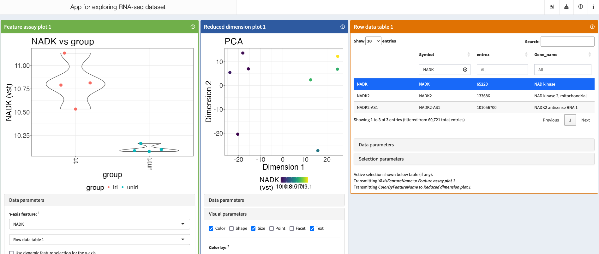
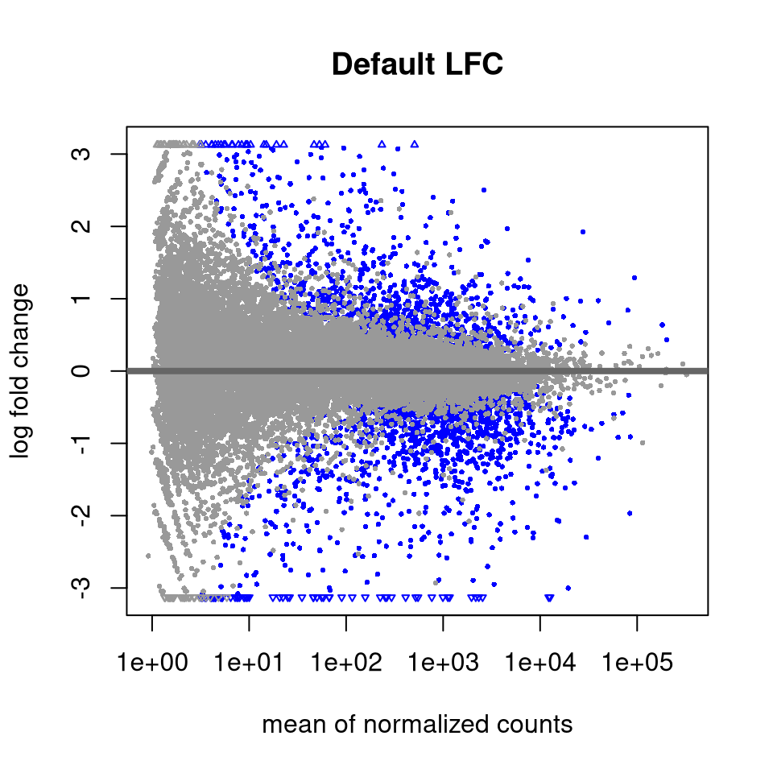
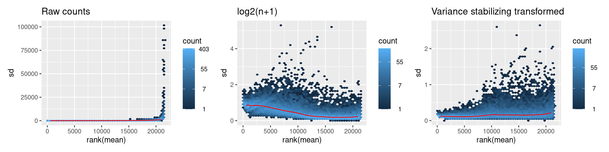
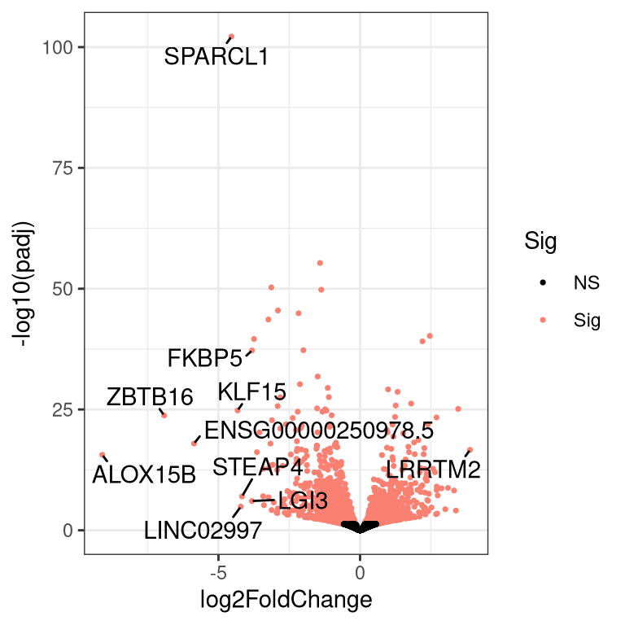
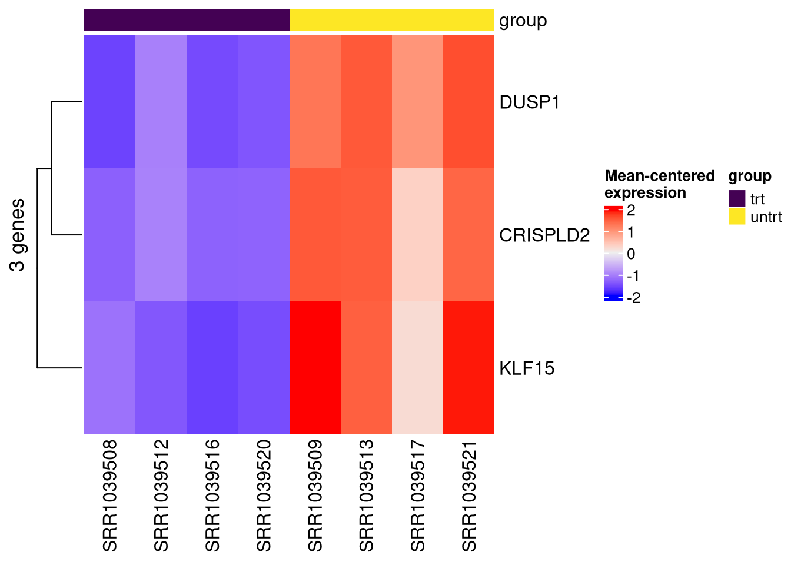

# **Basic RNA-Seq Analysis -- From fastq files to DE genes**

## **Run the BBC pipeline to align the reads**

### **The workflow as a graph**


### **Clone the Github repo**

First, go to [VAI OnDemand](https://ondemand.vai.zone/) and click on "Apps" > "hpc Shell Access".

Instructions for running the RNA-seq workflow are on the [Github README](https://github.com/vari-bbc/rnaseq_workflow), but here we will go through each step in more detail.

For a normal project, you would be working in your lab's storage space, but for today we will work in the `hpctmp` folder.


``` bash
cd /varidata/researchtemp/hpctmp/BBC_workshop_Oct2024_III/

mkdir <username>

cd <username>
```


``` bash
git clone https://github.com/vari-bbc/rnaseq_workflow.git rnaseq_workflow_testrun

```

The Github repository consisting of the RNA-seq workflow should now be downloaded in a folder named `rnaseq_workflow_testrun`.


``` bash
cd rnaseq_workflow_testrun

ls
```

### **Add your fastq files to `raw_data/`**

Instead of making multiple copies of the same file, which can quickly use up your lab's storage quota, we can use **symbolic links**. The sequence data that we will be using for this workshop are from the [airway dataset](https://pubmed.ncbi.nlm.nih.gov/24926665/) referenced in the DESeq2 vignette. The gene counts can actually be downloaded as an [R package](https://bioconductor.org/packages/release/data/experiment/html/airway.html).


``` bash
ls ../../0_fastqs/
```


``` bash
ln -sr ../../0_fastqs/* ./raw_data
```

You can see where the symbolic links are pointing to using `ls -l`.


``` bash
ls -l ./raw_data
```

### **Fill out the samplesheet**

The samplesheet is a tab-delimited file within `config/samplesheet/` and is named `units.tsv`. The easiest way to fill this out is to run the helper script, `make_units_template.sh`, to generate a template, then edit using a text editor.

FOR THIS WORKSHOP, NO CHANGES NEED TO BE MADE.


``` bash
cd config/samplesheet/

./make_units_template.sh
```

There should now be a file named 'units_template.tsv'.


``` bash
ls
```

We can replace the 'units.tsv' with 'units_template.tsv'.


``` bash
cp units_template.tsv units.tsv
```

Use `cat` to look at the samplesheet.


``` bash
cat units.tsv
```

The "group" column in `units.tsv` needs to be edited. Use the built-in editor in OnDemand to correct this column according to the values below. Tip: Within the OnDemand file explorer, click 'Change directory' and type `/varidata/researchtemp/hpctmp/BBC_workshop_Oct2024_III/<username>/rnaseq_workflow_testrun/config/samplesheet` to navigate directly to the correct folder.

| sample     | group |
| ---------- | ----- |
| SRR1039508 | trt   |
| SRR1039509 | untrt | 
| SRR1039512 | trt   |   
| SRR1039513 | untrt |
| SRR1039516 | trt   |
| SRR1039517 | untrt | 
| SRR1039520 | trt   |
| SRR1039521 | untrt |  

Go back to the base level of the project directory.


``` bash
cd ../..
```

Make sure you are at `/varidata/researchtemp/hpctmp/BBC_workshop_Oct2024_III/<username>/rnaseq_workflow_testrun`.


``` bash
pwd 

```

### **Fill out the config file**

The config file is a [YAML](https://en.wikipedia.org/wiki/YAML) file indicating the locations of reference files and also contains options for the workflow that you can turn off or turn on.

Typically, the main thing is to specify reference files corresponding to the species you have sequenced (human, mouse, or rat etc). For this workshop, we are dealing with human data so we will align to the hg38 reference.

Index files allow alignment algorithms to align reads to specific reference sequences.

FOR THIS WORKSHOP, NO CHANGES NEED TO BE MADE BECAUSE THE CORRECT INFORMATION HAVE ALREADY BEEN ENTERED.


``` bash

cat config/config.yaml
```

### **Submit the main Snakemake job**

If your lab has their own nodes that you wish to use, use `sbatch -p <lab_name> bin/run_snake.sh` instead of the command below.


``` bash
sbatch bin/run_snake.sh
```

### **BBC-maintained reference files**

For future reference, the BBC downloads and maintains commonly used files and indexes for several model species. These files are version controlled to promote reproducibility in case you need to rerun an analysis or you want to run the exact same analysis on different datasets.


``` bash
ls /varidata/research/projects/bbc/versioned_references/
```

```
## 2021-04-09_12.44.55_v1
## 2021-07-02_11.23.48_v3
## 2021-07-13_09.57.31_v4
## 2021-08-02_20.40.24_v5
## 2021-08-10_11.12.27_v6
## 2021-10-25_15.31.38_v7
## 2022-01-26_13.39.07_v8
## 2022-03-08_14.47.50_v9
## 2022-10-06_14.25.40_v10
## 2022-12-19_13.27.04_v11
## 2023-05-03_15.28.41_v12
## 2023-10-04_10.07.51_v13
## 2023-10-06_11.13.48_v14
## 2023-11-08_15.45.32_v15
## 2023-11-09_09.38.05_v16
## latest
## regarding_v2.txt
```


``` bash
ls /varidata/research/projects/bbc/versioned_references/2023-05-03_15.28.41_v12/data/
```

```
## GRCz11
## c.elegans-WBcel235
## dm6_BDGP6.28.100
## e.coli-K12-mg1665_ensembl
## hg19_gencode
## hg19_gencode_plus_ERCC92
## hg19_gencode_plus_viruses
## hg38_gencode
## mm10_gencode
## mm10_gencode_plus_ERCC92
## mm10_gencode_plus_e.coli-K12-mg1665_ensembl
## mm10_gencode_plus_viruses_and_cfmedips
## mm11_gencode
## mm9_ucsc
## mm_BALB_CJ
## mm_BALB_CJ_plus_viruses_and_cfmedips
## mm_FVB_NJ
## mm_FVB_NJ_plus_viruses_and_cfmedips
## rnor6_ensembl
```

The source of these files can be found in the `species.tsv` file.


``` bash
cat /varidata/research/projects/bbc/versioned_references/2023-05-03_15.28.41_v12/bin/species.tsv  | cut -f2-3
```

```
## id	genome_fasta
## mm10_gencode	ftp://ftp.ebi.ac.uk/pub/databases/gencode/Gencode_mouse/release_M24/GRCm38.primary_assembly.genome.fa.gz
## hg38_gencode	ftp://ftp.ebi.ac.uk/pub/databases/gencode/Gencode_human/release_33/GRCh38.primary_assembly.genome.fa.gz
## e.coli-K12-mg1665_ensembl	ftp://ftp.ensemblgenomes.org/pub/release-47/bacteria//fasta/bacteria_0_collection/escherichia_coli_str_k_12_substr_mg1655/dna/Escherichia_coli_str_k_12_substr_mg1655.ASM584v2.dna.chromosome.Chromosome.fa.gz
## hg19_gencode	ftp://ftp.ebi.ac.uk/pub/databases/gencode/Gencode_human/release_36/GRCh37_mapping/GRCh37.primary_assembly.genome.fa.gz
## dm6_BDGP6.28.100	ftp://ftp.ensembl.org/pub/release-100/fasta/drosophila_melanogaster/dna/Drosophila_melanogaster.BDGP6.28.dna.toplevel.fa.gz
## c.elegans-WBcel235	http://ftp.ensembl.org/pub/release-103/fasta/caenorhabditis_elegans/dna/Caenorhabditis_elegans.WBcel235.dna.toplevel.fa.gz
## mm_BALB_CJ	http://ftp.ensembl.org/pub/release-104/fasta/mus_musculus_balbcj/dna/Mus_musculus_balbcj.BALB_cJ_v1.dna.toplevel.fa.gz
## mm_FVB_NJ	http://ftp.ensembl.org/pub/release-104/fasta/mus_musculus_fvbnj/dna/Mus_musculus_fvbnj.FVB_NJ_v1.dna.toplevel.fa.gz
## rnor6_ensembl	http://ftp.ensembl.org/pub/release-104/fasta/rattus_norvegicus/dna/Rattus_norvegicus.Rnor_6.0.dna.toplevel.fa.gz
## GRCz11	https://ftp.ensembl.org/pub/release-108/fasta/danio_rerio/dna/Danio_rerio.GRCz11.dna.toplevel.fa.gz
## mm11_gencode	https://ftp.ebi.ac.uk/pub/databases/gencode/Gencode_mouse/release_M31/GRCm39.primary_assembly.genome.fa.gz
## mm9_ucsc	ftp://hgdownload.cse.ucsc.edu/goldenPath/mm9/bigZips/mm9.fa.gz
```

The versions of the software used to generate the index files can be found in the `config.yaml` file. Sometimes index files are not backwards-compatible, meaning index files generated by a newer version of a tool cannot be used by an older version of the tool.


``` bash
cat /varidata/research/projects/bbc/versioned_references/2023-05-03_15.28.41_v12/bin/config.yaml
```

```
## # This is the directory that the rsync rule will use as the source directory. It shuold be the run directory this workflow.
## sourceDir: "/varidata/research/projects/bbc/research/prep_bbc_shared_current"
## 
## # This is where the timestamped directories and the 'latest' symlink will be created.
## timestamp_dir: "/varidata/research/projects/bbc/versioned_references/"
## 
## # Environment modules used.
## # Specify all environment modules here instead of within the Snakefile itself to make it easy to look over quickly.
## # When aligning using the index files created by this workflow, use the same version aligner as listed here to ensure compatibility.
## samtools:   "bbc/samtools/samtools-1.9"
## picard:     "bbc/picard/picard-2.21.4-SNAPSHOT"
## STAR:       "bbc/STAR/STAR-2.7.8a"
## biscuit:    "bbc/biscuit/biscuit_1_0_1"
## bwa:        "bbc/bwa/bwa-0.7.17"
## bowtie2:    "bbc/bowtie2/bowtie2-2.4.1"
## python3:    "bbc/python3/python-3.8.1"
## bismark:    "bbc/bismark/bismark-0.23.0"
## kb-python:  "bbc/kb-python/kb-python-0.24.4"
## parallel:   "bbc/parallel/parallel-20191122"
## gsutil:     "bbc/gsutil/gsutil-4.52"
## seqtk:      "bbc/seqtk/seqtk-1.3-r115-dirty"
## salmon:     "bbc/salmon/salmon-1.4.0"
## kallisto:   "bbc/kallisto/kallisto-0.46.1"
```

## **Symlink pre-run results to your directory**

Because the workflow will take a while (up to several hours) to run, we have run the workflow for you beforehand so that you don't have to wait for your workflow to finish running.

First, go to the base level of your "<username>" directory.


``` bash
cd /varidata/researchtemp/hpctmp/BBC_workshop_Oct2024_III/<username>

```

Then create the symlink.


``` bash
ln -s ../kin.lau/rnaseq_workflow/ .
```

## **Quality control**

It's important to look through QC metrics to ensure that the data is likely to produce meaningful results. Ideally, you don't want to waste time trying to interpret bad data.

### **multiQC report**

Use the OnDemand file explorer to download and open `/varidata/researchtemp/hpctmp/BBC_workshop_Oct2024_III/<username>/rnaseq_workflow/results/multiqc/multiqc_report.html`. _Remember_ that within the OnDemand file explorer, you can click 'Change directory' to navigate directly to the enclosing directory.

* Alignment rate?
* Higher duplication rate can be normal for RNA-seq.
* Strandedness; In our workflow, this is automatically inferred using Salmon.
* Any contamination? Check FastqScreen results.

### **Other considerations**

* Not a bad idea to look quickly at the alignments in IGV. Any sign of gDNA contamination?
* Mutations in specific genotypes? Is it exonic? Can do a quick check in IGV.
* How many genes expressed? Easy to check in R.
* Marker genes? Can do a quick check in iSEE if you expect certain expression patterns between groups.
* Any genes supposed to knocked out or knocked down? Use iSEE.
* Does the PCA show clustering? Use iSEE.


## **DE analysis using R and DESeq2**

### **Create an R project**

1. Please go to [VAI OnDemand](https://ondemand.vai.zone/).

2. Click on RStudio Server, and create a new RStudio session. Please make sure you are loading the correct R module for this workshop, `bbc2/R/alt/R-4.4.0-setR_LIBS_USER`, which you can select from the drop down menu. Type "quick" in the "Partition" field. can be "quick" (if you encounter issues, you can also try "short" or "long"). Set CPU as 1, memory as 16GB, and time as 6 hours. Click "Launch".

3. In the Rstudio window, click "File" in the upper left corner, click on "New Project" > "New Directory" > "New Project". Then, click on "Browse...", you can click on triple dot horizontal button and type `/varidata/researchtemp/hpctmp/BBC_workshop_Oct2024_III/<username>`. Click "choose". Next, you will go back to the project wizard, and type "workshop_2024" in the "Directory name" field. Click "Create Project". You will be the newly created "workshop_2024" folder, which will contain a new file named "workshop_2024.Rproj", which Rstudio uses to store details about your R project.


#### Why create R projects?

**Creating an R Project in RStudio is recommended for several reasons:**  

1. A R Project creates a dedicated working directory for your project files, including R scripts, data files, figures, and output. This helps in organizing your files that are related to a specific project.     

2. Automatic working directory setup. When you open an R Project, RStudio automatically sets the working directory to the project folder.  

3. Reproducibility. With a project-based setup, the code and files related to a project stay together, making it easier to reproduce results.   

4. Version control integration and package development support. 


### **Exploring the data using iSEE**

The [iSEE](https://www.bioconductor.org/packages/release/bioc/html/iSEE.html) app allows us to explore our data interactively, making changes on-the-fly. It is more convenient to mount the HPC storage to your computer and run iSEE locally, but for simplicity we will follow the steps below to run iSEE via OnDemand Rstudio.

Go to the terminal. Go to your newly created `workshop_2024` R project directory, then copy `app.R` and `sce.rds` from `rnaseq_workflow/iSEE/` to there.


``` bash
cd /varidata/researchtemp/hpctmp/BBC_workshop_Oct2024_III/<username>/workshop_2024

cp ../rnaseq_workflow/iSEE/* .

```

To run the iSEE app, go back to OnDemand Rstudio, open the `app.R` file and click "Source".




### **Make a separate folder for DE analysis and a script file to store our commands**

1. We will create a new folder for the differential expression analysis of this workshop. Click "New Folder" and enter "DE_genes" for the folder name.

2. Create an R script file to record the code that you will use for this part of the workshop today. Click on the "DE_genes" folder to enter it. Click "New Blank File" > "R script". Type in "deseq2.R" for the filename and click "OK". Unless otherwise noted, run all following code by copying and pasting into "deseq2.R" then highlighting the commands you want to run and typing either Cmd + Enter (Mac) or Ctrl + Enter (Windows).


### **Make an output directory**

To ensure it is clear which files are produced by a given script, it is good practice to make a unique folder for storing each script's output.


``` r
outdir <- "./DE_genes/deseq2_out_files/"

dir.create(outdir, recursive=TRUE)
```


### **Install packages**

For this workshop, we ran the Rstudio job with the `bbc2/R/alt/R-4.4.0-setR_LIBS_USER` module. This allows you to use R packages that we have installed beforehand. For your actual work, we encourage you to run Rstudio jobs with the `bbc2/R/R-4.4.0` module which will allows you to make and maintain your own R package library, avoiding permission issues when updating packages or installing new ones.

While CRAN packages can be installed with `install.packages()`, [Bioconductor](https://bioconductor.org/) packages have to be installed with the `install()` function in the [BiocManager package](https://cran.r-project.org/web/packages/BiocManager/vignettes/BiocManager.html).


``` r
# AS EXPLAINED ABOVE, NO NEED TO RUN THESE FOR THE WORKSHOP
# if (!require("BiocManager", quietly = TRUE))
#     install.packages("BiocManager")
# 
# BiocManager::install(c("dplyr","stringr","ggplot2","readr","ggrepel","ComplexHeatmap","DESeq2","iSEE"))
```

### **Load packages**

In order to let R know where to look for the functions we will use, we need to load them using the `library()` function. The `suppressPackageStartupMessages()` function calls here are simply to mute the automatic start-up messages of some of these packages to avoid cluttering what we are looking at.


``` r
suppressPackageStartupMessages(library(dplyr))
library(stringr)
library(ggplot2)
library(readr)
library(ggrepel)
suppressPackageStartupMessages(library(ComplexHeatmap))
suppressPackageStartupMessages(library(DESeq2))
```

### **Set up your DESeq object**

The BBC Snakemake workflow collates all the gene counts into an R object saved in the `results/SummarizedExperiment/SummarizedExperiment.rds` file. The `readRDS` function loads that object into our environment.


``` r
se <- readRDS("../rnaseq_workflow/results/SummarizedExperiment/SummarizedExperiment.rds")

# What is type of object is this?
class(se)
```


### **What is a SummarizedExperiment object?**

A [SummarizedExperiment](https://bioconductor.org/packages/release/bioc/vignettes/SummarizedExperiment/inst/doc/SummarizedExperiment.html) object allows us to store and manipulate sample meta data, gene meta data and gene counts in separate, coordinated dataframes and matrices. Subsetting and reordering samples or genes can be done using the familiar `object[row, column]` R syntax, where the genes are the rows and the samples are the columns (`object[genes, samples]`). Later on, we will go through some exercises to further demonstrate the usefulness of "SummarizedExperiment" objects.


Let's take a look to see what assays are stored in the SummarizedExperiment object. Note that DESeq2 requires the first assay to be named "counts" and assumes it contains the raw counts.


``` r
assayNames(se)
```

```
## [1] "counts" "tpms"   "vst"
```

``` r
stopifnot(assayNames(se)[1] == "counts")
```

Let's take a look at the sample meta data in the "se" object. The BBC snakemake workflow automatically adds the samplesheet metadata into the "se" object.


``` r
colData(se)
```

```
## DataFrame with 8 rows and 3 columns
##                 sample       group        RG
##            <character> <character> <logical>
## SRR1039508  SRR1039508         trt        NA
## SRR1039512  SRR1039512         trt        NA
## SRR1039516  SRR1039516         trt        NA
## SRR1039520  SRR1039520         trt        NA
## SRR1039509  SRR1039509       untrt        NA
## SRR1039513  SRR1039513       untrt        NA
## SRR1039517  SRR1039517       untrt        NA
## SRR1039521  SRR1039521       untrt        NA
```

Similarly, the gene meta data can be used to store alternate gene names. These will come in handy for downstream visualizations or pathway analyses.


``` r
rowData(se)
```

```
## DataFrame with 60721 rows and 4 columns
##                         Symbol              Uniq_syms      entrez
##                    <character>            <character> <character>
## ENSG00000223972.5           NA      ENSG00000223972.5          NA
## ENSG00000227232.5           NA      ENSG00000227232.5          NA
## ENSG00000278267.1    MIR6859-2 MIR6859-2_ENSG000002..   102465909
## ENSG00000243485.5           NA      ENSG00000243485.5          NA
## ENSG00000284332.1    MIR1302-2              MIR1302-2   100302278
## ...                        ...                    ...         ...
## ENSG00000276017.1           NA      ENSG00000276017.1          NA
## ENSG00000278817.1        DGCR6 DGCR6_ENSG0000027881..        8214
## ENSG00000277196.4        PRODH PRODH_ENSG0000027719..        5625
## ENSG00000278625.1 LOC124905334           LOC124905334   124905334
## ENSG00000277374.1           NA      ENSG00000277374.1          NA
##                                Gene_name
##                              <character>
## ENSG00000223972.5                     NA
## ENSG00000227232.5                     NA
## ENSG00000278267.1        microRNA 6859-2
## ENSG00000243485.5                     NA
## ENSG00000284332.1        microRNA 1302-2
## ...                                  ...
## ENSG00000276017.1                     NA
## ENSG00000278817.1 DiGeorge syndrome cr..
## ENSG00000277196.4 proline dehydrogenas..
## ENSG00000278625.1    U6 spliceosomal RNA
## ENSG00000277374.1                     NA
```

The counts and the meta data need to be stored inside a DESeq2 object called a 'DESeqDataSet', which is also a 'SummarizedExperiment' so 'SummarizedExperiment' functions will work on it. We specify that each gene will be fit with a model design of '~ group'.


``` r
dds <- DESeqDataSet(se, design = ~ group)
```

```
## converting counts to integer mode
```

```
## Warning in DESeqDataSet(se, design = ~group): some variables in design formula
## are characters, converting to factors
```

### **Remove genes with low/no expression**

We cannot do meaningful analyses of genes with very low counts. This will also speed up the analysis.


``` r
# prefilter genes, keeping only genes with 10 or more total read counts across samples
keep <- rowSums(counts(dds)) >= 10 # counts() is the same as assay(dds, "counts")

message(str_glue("Keeping {sum(keep)} genes."))
```

```
## Keeping 21485 genes.
```

``` r
dds <- dds[keep, ]
```

### **Different normalization approaches for different biases**

[Types of biases in RNA-seq](https://vanandelinstitute-my.sharepoint.com/:b:/g/personal/kin_lau_vai_org/EcruvwL-OrBIvCzXZ7HMPlcBo65fu0pucrivMmCwzM98dA?e=yCkfTa)

### **Run the DE workflow**

The [DESeq](https://www.rdocumentation.org/packages/DESeq2/versions/1.12.3/topics/DESeq) function is a convenience function from DESeq2 that estimates size factors (normalization) and fits negative binomial GLMs.


``` r
dds <- DESeq(dds)
```

```
## estimating size factors
```

```
## estimating dispersions
```

```
## gene-wise dispersion estimates
```

```
## mean-dispersion relationship
```

```
## final dispersion estimates
```

```
## fitting model and testing
```

``` r
message(paste0("Coefficient names are: ", paste(resultsNames(dds), collapse = " ")))
```

```
## Coefficient names are: Intercept group_untrt_vs_trt
```

After the models are fitted, we can test specific pairs of groups for differential expression. For DESeq2, it is recommended to provide the significance cutoff that you wish to use as it affects the multiple testing correction procedure (see [docs](https://www.rdocumentation.org/packages/DESeq2/versions/1.12.3/topics/results)). Here we specify a significance cutoff of 0.05.


``` r
contrast <- c("group", "trt", "untrt")
fdr_cutoff <- 0.05

res <- results(dds, contrast=contrast, alpha=fdr_cutoff)
res <- res[order(res$pvalue), ]
```

### **Summarize DE results**

Let's see how many genes were significantly up or down regulated.


``` r
df <- as.data.frame(res)
data.frame(
  UP=sum(df$padj <= fdr_cutoff & df$log2FoldChange > 0, na.rm = TRUE),
  DWN=sum(df$padj <= fdr_cutoff & df$log2FoldChange < 0, na.rm = TRUE),
  Tested=sum(!is.na(df$padj))
)
```

```
##     UP  DWN Tested
## 1 1158 1534  18105
```

### **P value distribution**

Ideally, we will see an anti-conservative (if there are many DE genes) or uniform pattern (not many DE genes). See [here](http://varianceexplained.org/statistics/interpreting-pvalue-histogram/) for more details about how to interpret these.


``` r
ggplot(data = df %>%
         dplyr::filter(!is.na(pvalue)),
       aes(x = pvalue)) +
  geom_histogram(color = "black", fill = "gray55",
                 breaks = seq(0, 1, 0.05)) + theme_bw() + theme(plot.title=element_text(size=10))
```


### **Shrink log fold changes for lowly expressed genes**

This step does not affect which genes are statistically DE, but we perform this to obtain more reliable estimates of the log fold changes for visualizations or for ranking genes (e.g. GSEA).


``` r
lfc_shrink <- lfcShrink(dds, contrast=contrast, type="ashr")
```

```
## using 'ashr' for LFC shrinkage. If used in published research, please cite:
##     Stephens, M. (2016) False discovery rates: a new deal. Biostatistics, 18:2.
##     https://doi.org/10.1093/biostatistics/kxw041
```

``` r
lfc_shrink <- lfc_shrink[order(lfc_shrink$pvalue), ]
```

Let's visualize the effect of shrinking the LFCs using MA plots.


``` r
DESeq2::plotMA(res, main="Default LFC")
```




``` r
DESeq2::plotMA(lfc_shrink, main="Shrunken LFC")
```


### **Output DE results**

Here, we merge the different gene name columns to the DE results and output to a tab-delimited file, which can be opened in Excel for manual perusal.

NOTE: You will use this file for the next section of the workshop about pathway analysis.


``` r
df <- cbind(as.data.frame(rowData(dds)[rownames(lfc_shrink), 1:4]),
            as.data.frame(lfc_shrink)) %>%
  tibble::rownames_to_column("ens_gene")
```


``` r
write_tsv(df, file.path(outdir, "de_res.tsv"))
```

### **Output tables with log2 normalized counts**

For the log2 normalized counts, we commonly use the variance stabilized transformation ([VST](https://rdrr.io/bioc/DESeq2/man/varianceStabilizingTransformation.html)). These values can be used for heatmaps, clustering or other downstream applications.


``` r
vsd <- vst(dds, blind=FALSE)

vst_df <- as.data.frame(cbind(rowData(vsd)[, 1:4], assay(vsd))) %>%
  tibble::rownames_to_column("ens_gene")
```


``` r
write_tsv(vst_df, file.path(outdir, "vst.tsv"))
```

### **Why should we transform counts for visualizations or clustering?**

Biological factors can increase gene count variation, but this can be muddied by dependence of the variance on the magnitude of the mean. Below, we can visualize how different transformations impact the mean-variance relationship. Here we also reiterate that these transformations are only for analyses downstream of DE analysis; the statistical framework in DESeq2 (and edgeR) is designed to work with raw counts.


``` r
library(vsn)
library(patchwork)

ntd <- normTransform(dds) # log2(n + 1)

gg1 <- meanSdPlot(counts(dds), plot=FALSE)[["gg"]] + ggtitle("Raw counts")
gg2 <- meanSdPlot(assay(ntd), plot=FALSE)[["gg"]] + ggtitle("log2(n+1)")
gg3 <- meanSdPlot(assay(vsd), plot=FALSE)[["gg"]] + ggtitle("Variance stabilizing transformed")

# use patchwork to combine the three plots into one figure.
(gg1 | gg2 | gg3) + plot_layout(nrow = 1)
```




## **Volcano plot**

First, run the code below which makes a new function to make a volcano plot.


``` r
make_volcano <- function(df, pval_nm, pval_cutoff=0.1){
  # remove genes with NA for pvalue
  df <- df[which(!is.na(df[[pval_nm]])), ]
  
  # add gene names
  df <- cbind(df, rowData(dds)[rownames(df), 1:4])
  
  top_genes <- df %>%
    dplyr::arrange(desc(abs(df$log2FoldChange))) %>%
    dplyr::filter(row_number() <= 10) %>%
    rownames()
  
  df$Sig <- ifelse(df$padj <= pval_cutoff, "Sig", "NS")
  
  df[[pval_nm]] <- -log10(df[[pval_nm]])
  
  
  ggplot(df, aes(x=.data[["log2FoldChange"]], y=.data[[pval_nm]])) +
    geom_point(aes(color=Sig), size=0.6) +
    scale_color_manual(values=c("black", "salmon")) +
    theme_bw() + ylab(str_glue("-log10(", pval_nm,")")) +
    geom_text_repel(data=df[top_genes, ],
                    aes(label=Uniq_syms), max.overlaps=Inf, min.segment.length = 0)
}
```

Run the command below to use the above function to make a volcano plot. Functions can help reduce the amount of code we have to write if we have to run similar code multiple times; for example, if we had multiple groups in our experiment and wanted to make volcano plots for several different contrasts.


``` r
make_volcano(as.data.frame(lfc_shrink),
             pval_nm="padj", pval_cutoff=fdr_cutoff)
```




## **Make a new SummarizedExperiment to store all results**


``` r
# recall that we removed some genes new little or no expression.
se2 <- se[rownames(dds), ]

# replace the old variance-stabilized transformed counts
stopifnot(identical(rownames(se2), rownames(vsd)))
assay(se2, "vst") <- assay(vsd)

# Add DE results
rowData(se2)$trt.v.untrt.pval <- as.data.frame(lfc_shrink)[rownames(se2), "pvalue"]
rowData(se2)$trt.v.untrt.padj <- as.data.frame(lfc_shrink)[rownames(se2), "padj"]
rowData(se2)$trt.v.untrt.lfc <- as.data.frame(lfc_shrink)[rownames(se2), "log2FoldChange"]
rowData(se2)
```

```
## DataFrame with 21485 rows and 7 columns
##                          Symbol              Uniq_syms      entrez
##                     <character>            <character> <character>
## ENSG00000227232.5            NA      ENSG00000227232.5          NA
## ENSG00000278267.1     MIR6859-2 MIR6859-2_ENSG000002..   102465909
## ENSG00000241860.7            NA      ENSG00000241860.7          NA
## ENSG00000279457.4            NA      ENSG00000279457.4          NA
## ENSG00000228463.10    RPL23AP21              RPL23AP21      728481
## ...                         ...                    ...         ...
## ENSG00000273748.1            NA      ENSG00000273748.1          NA
## ENSG00000271254.6  LOC102724250           LOC102724250   102724250
## ENSG00000278673.1            NA      ENSG00000278673.1          NA
## ENSG00000278817.1         DGCR6 DGCR6_ENSG0000027881..        8214
## ENSG00000277196.4         PRODH PRODH_ENSG0000027719..        5625
##                                 Gene_name trt.v.untrt.pval trt.v.untrt.padj
##                               <character>        <numeric>        <numeric>
## ENSG00000227232.5                      NA         0.699875          0.88721
## ENSG00000278267.1         microRNA 6859-2         0.941844               NA
## ENSG00000241860.7                      NA         0.488979               NA
## ENSG00000279457.4                      NA         0.650232          0.86135
## ENSG00000228463.10 ribosomal protein L2..         0.446495               NA
## ...                                   ...              ...              ...
## ENSG00000273748.1                      NA      6.98054e-01      0.886856022
## ENSG00000271254.6  neuroblastoma breakp..      9.71630e-05      0.001446724
## ENSG00000278673.1                      NA      9.47906e-01               NA
## ENSG00000278817.1  DiGeorge syndrome cr..      3.02400e-02               NA
## ENSG00000277196.4  proline dehydrogenas..      1.47224e-05      0.000285074
##                    trt.v.untrt.lfc
##                          <numeric>
## ENSG00000227232.5       0.03692037
## ENSG00000278267.1       0.00642251
## ENSG00000241860.7       0.06385483
## ENSG00000279457.4       0.04216935
## ENSG00000228463.10      0.07241761
## ...                            ...
## ENSG00000273748.1      -0.03748339
## ENSG00000271254.6       0.66240875
## ENSG00000278673.1      -0.00502522
## ENSG00000278817.1      -0.28581340
## ENSG00000277196.4      -2.92429454
```


## **Heatmap of top DE genes**


``` r
make_ht <- function(se, genes, assay_nm="vst", col_annot = "group", row_label = "Uniq_syms"){
  ht_se <- se[genes, ]
  coldat <- as.data.frame(colData(ht_se)[, col_annot, drop=FALSE])
  coldat_lvls <- unique(coldat[, 1])
  ht_col_colors <- list(setNames(nm=coldat_lvls, object = viridis::viridis(length(coldat_lvls))))
  names(ht_col_colors) <- col_annot
  
  Heatmap(t(scale(t(assay(ht_se, assay_nm)), scale=FALSE, center = TRUE)), 
          name = "Mean-centered\nexpression", 
          cluster_columns = FALSE,
          row_labels=rowData(ht_se)[, row_label],
          show_column_names = TRUE,
          top_annotation=HeatmapAnnotation(df=coldat, 
                                           col=ht_col_colors),
          row_title = paste0(nrow(ht_se), " genes")
  )
}
```


``` r
# sort genes in the se object based on significance.
se2 <- se2[order(rowData(se2)$trt.v.untrt.pval), ]
top_genes <- rownames(se2)[1:20]

make_ht(se=se2, genes=top_genes, assay_nm="vst", col_annot = "group")
```


## **Look for specific genes**

We know certain genes should be differentially expressed based on the [paper](https://pubmed.ncbi.nlm.nih.gov/24926665/) that this dataset came from. We can check that these genes were significantly DE in our analysis.


``` r
gois <- c("DUSP1", "KLF15", "CRISPLD2")

# we need to convert these to ensembl IDs
gois <- rownames(se2)[match(gois, rowData(se2)[, "Symbol"])]

make_ht(se=se2, genes=gois, assay_nm="vst", col_annot = "group")
```



## **SummarizedExperiment exercises**


## **Your turn**

1. Copy 'se2' to make a new object. Filter for significance then rank by the absolute value of LFC, largest to smallest.
2. Reorder the samples in the new object so that 'untrt' samples are on the left in the heatmap.
3. Plot top DEGs heatmap based on LFC ranking.

<details>
<summary>Click here to see an example solution</summary>


``` r
se3 <- se2
se3 <- se3[which(rowData(se3)$trt.v.untrt.padj <= 0.05), ] # note that some rows have NAs in this column, so we use which()
se3 <- se3[order(abs(rowData(se3)$trt.v.untrt.lfc), decreasing = TRUE), ]
se3 <- se3[, rev(order(se3$group))]

top_genes <- rownames(se3)[1:30]

make_ht(se=se3, genes=top_genes, assay_nm="vst", col_annot = "group")
```

</details>
<br>


## **Venn diagrams**

One option is [ggVennDiagram](https://cran.r-project.org/web/packages/ggVennDiagram/readme/README.html).


## **Upset plots**

We recommend using the [ComplexHeatmap package](https://jokergoo.github.io/ComplexHeatmap-reference/book/upset-plot.html).


