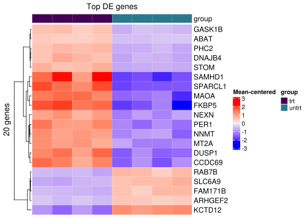

# **Basic RNA-Seq Analysis -- From fastq files to DE genes**

## **Run the BBC pipeline to align the reads**

### **The workflow as a graph**


### **Clone the Github repo**

Instructions for running it are on the [Github README](https://github.com/vari-bbc/rnaseq_workflow), but here we will go through each step in more detail.


```bash
cd /varidata/researchtemp/hpctmp/BBC_workshop_June2023_II/

mkdir <username>

cd <username>
```


```bash
git clone https://github.com/vari-bbc/rnaseq_workflow.git 

```

The Github repository consisting of the RNA-seq workflow should now be downloaded in a folder named `rnaseq_workflow`.


```bash
cd rnaseq_workflow

ls
```

### **Add your fastq files to `raw_data/`**

Instead of making multiple copies of the same file, which can quickly use up your lab's storage quota, we can use **symbolic links**. The sequence data that we will be using for this workshop are from the [airway dataset](https://pubmed.ncbi.nlm.nih.gov/24926665/) referenced in the DESeq2 vignette. The gene counts can actually be downloaded as an [R package](https://bioconductor.org/packages/release/data/experiment/html/airway.html).


```bash
ls ../../0_fastqs/
```


```bash
ln -sr ../../0_fastqs/* ./raw_data
```

You can see where the symbolic links are pointing to using `ls -l`.


```bash
ls -l ./raw_data
```

### **Fill out the samplesheet**

The samplesheet is a tab-delimited file within `config/samplesheet/` and is named `units.tsv`. The easiest way to fill this out is to run the helper script, `make_units_template.sh`, to generate a template, then edit using a text editor.

FOR THIS WORKSHOP, NO CHANGES NEED TO BE MADE.


```bash
cd config/samplesheet/

./make_units_template.sh
```

There should now be a file named 'units_template.tsv'.


```bash
ls
```

We can replace the 'units.tsv' with 'units_template.tsv'.


```bash
mv units_template.tsv units.tsv
```

Go back to the base level of the project directory.


```bash
cd ../..
```

Make sure you are at `/varidata/researchtemp/hpctmp/BBC_workshop_June2023_II/<username>/rnaseq_workflow`.


```bash
pwd 

```

### **Fill out the config file**

The config file is a [YAML](https://en.wikipedia.org/wiki/YAML) file indicating the locations of reference files and also contains options for the workflow that you can turn off or turn on.

Typically, the main thing is to specify reference files corresponding to the species you have sequenced (human, mouse, or rat etc). For this workshop, we are dealing with human data so we will align to the hg38 reference.

Index files allow alignment algorithms to align reads to specific reference sequences.

FOR THIS WORKSHOP, NO CHANGES NEED TO BE MADE.


```bash

cat config/config.yaml
```

### **Submit the main Snakemake job**


```bash
sbatch -p big bin/run_snake.sh
```

### **BBC-maintained reference files**

For future reference, the BBC downloads and maintains commonly used files and indexes for several model species. These files are version controlled to promote reproducibility in case you need to rerun an analysis or you want to run the exact same analysis on different datasets.


```bash
ls /varidata/research/projects/bbc/versioned_references/
```

```
## 2021-04-09_12.44.55_v1
## 2021-07-02_11.23.48_v3
## 2021-07-13_09.57.31_v4
## 2021-08-02_20.40.24_v5
## 2021-08-10_11.12.27_v6
## 2021-10-25_15.31.38_v7
## 2022-01-26_13.39.07_v8
## 2022-03-08_14.47.50_v9
## 2022-10-06_14.25.40_v10
## 2022-12-19_13.27.04_v11
## 2023-05-03_15.28.41_v12
## 2023-10-04_10.07.51_v13
## 2023-10-06_11.13.48_v14
## 2023-11-08_15.45.32_v15
## 2023-11-09_09.38.05_v16
## latest
## regarding_v2.txt
```


```bash
ls /varidata/research/projects/bbc/versioned_references/2023-05-03_15.28.41_v12/data/
```

```
## GRCz11
## c.elegans-WBcel235
## dm6_BDGP6.28.100
## e.coli-K12-mg1665_ensembl
## hg19_gencode
## hg19_gencode_plus_ERCC92
## hg19_gencode_plus_viruses
## hg38_gencode
## mm10_gencode
## mm10_gencode_plus_ERCC92
## mm10_gencode_plus_e.coli-K12-mg1665_ensembl
## mm10_gencode_plus_viruses_and_cfmedips
## mm11_gencode
## mm9_ucsc
## mm_BALB_CJ
## mm_BALB_CJ_plus_viruses_and_cfmedips
## mm_FVB_NJ
## mm_FVB_NJ_plus_viruses_and_cfmedips
## rnor6_ensembl
```

The source of these files can be found in the `species.tsv` file.


```bash
cat /varidata/research/projects/bbc/versioned_references/2023-05-03_15.28.41_v12/bin/species.tsv  | cut -f2-3
```

```
## id	genome_fasta
## mm10_gencode	ftp://ftp.ebi.ac.uk/pub/databases/gencode/Gencode_mouse/release_M24/GRCm38.primary_assembly.genome.fa.gz
## hg38_gencode	ftp://ftp.ebi.ac.uk/pub/databases/gencode/Gencode_human/release_33/GRCh38.primary_assembly.genome.fa.gz
## e.coli-K12-mg1665_ensembl	ftp://ftp.ensemblgenomes.org/pub/release-47/bacteria//fasta/bacteria_0_collection/escherichia_coli_str_k_12_substr_mg1655/dna/Escherichia_coli_str_k_12_substr_mg1655.ASM584v2.dna.chromosome.Chromosome.fa.gz
## hg19_gencode	ftp://ftp.ebi.ac.uk/pub/databases/gencode/Gencode_human/release_36/GRCh37_mapping/GRCh37.primary_assembly.genome.fa.gz
## dm6_BDGP6.28.100	ftp://ftp.ensembl.org/pub/release-100/fasta/drosophila_melanogaster/dna/Drosophila_melanogaster.BDGP6.28.dna.toplevel.fa.gz
## c.elegans-WBcel235	http://ftp.ensembl.org/pub/release-103/fasta/caenorhabditis_elegans/dna/Caenorhabditis_elegans.WBcel235.dna.toplevel.fa.gz
## mm_BALB_CJ	http://ftp.ensembl.org/pub/release-104/fasta/mus_musculus_balbcj/dna/Mus_musculus_balbcj.BALB_cJ_v1.dna.toplevel.fa.gz
## mm_FVB_NJ	http://ftp.ensembl.org/pub/release-104/fasta/mus_musculus_fvbnj/dna/Mus_musculus_fvbnj.FVB_NJ_v1.dna.toplevel.fa.gz
## rnor6_ensembl	http://ftp.ensembl.org/pub/release-104/fasta/rattus_norvegicus/dna/Rattus_norvegicus.Rnor_6.0.dna.toplevel.fa.gz
## GRCz11	https://ftp.ensembl.org/pub/release-108/fasta/danio_rerio/dna/Danio_rerio.GRCz11.dna.toplevel.fa.gz
## mm11_gencode	https://ftp.ebi.ac.uk/pub/databases/gencode/Gencode_mouse/release_M31/GRCm39.primary_assembly.genome.fa.gz
## mm9_ucsc	ftp://hgdownload.cse.ucsc.edu/goldenPath/mm9/bigZips/mm9.fa.gz
```

The versions of the software used to generate the index files can be found in the `config.yaml` file. Sometimes index files are not backwards-compatible, meaning index files generated by a newer version of a tool cannot be used by an older version of the tool.


```bash
cat /varidata/research/projects/bbc/versioned_references/2023-05-03_15.28.41_v12/bin/config.yaml
```

```
## # This is the directory that the rsync rule will use as the source directory. It shuold be the run directory this workflow.
## sourceDir: "/varidata/research/projects/bbc/research/prep_bbc_shared_current"
## 
## # This is where the timestamped directories and the 'latest' symlink will be created.
## timestamp_dir: "/varidata/research/projects/bbc/versioned_references/"
## 
## # Environment modules used.
## # Specify all environment modules here instead of within the Snakefile itself to make it easy to look over quickly.
## # When aligning using the index files created by this workflow, use the same version aligner as listed here to ensure compatibility.
## samtools:   "bbc/samtools/samtools-1.9"
## picard:     "bbc/picard/picard-2.21.4-SNAPSHOT"
## STAR:       "bbc/STAR/STAR-2.7.8a"
## biscuit:    "bbc/biscuit/biscuit_1_0_1"
## bwa:        "bbc/bwa/bwa-0.7.17"
## bowtie2:    "bbc/bowtie2/bowtie2-2.4.1"
## python3:    "bbc/python3/python-3.8.1"
## bismark:    "bbc/bismark/bismark-0.23.0"
## kb-python:  "bbc/kb-python/kb-python-0.24.4"
## parallel:   "bbc/parallel/parallel-20191122"
## gsutil:     "bbc/gsutil/gsutil-4.52"
## seqtk:      "bbc/seqtk/seqtk-1.3-r115-dirty"
## salmon:     "bbc/salmon/salmon-1.4.0"
## kallisto:   "bbc/kallisto/kallisto-0.46.1"
```

## **Quality control**

It's important to look through QC metrics to ensure that the data is likely to produce meaningful results. Ideally, you don't want to waste time trying to interpret bad data.

### **multiQC report**

Navigate to your project folder using Finder (Mac) or File Explorer (Windows). Find `results/multiqc/multiqc_report.html` and double-click it.

* Alignment rate?
* Higher duplication rate can be normal for RNA-seq.
* Strandedness; In our workflow, this is automatically inferred using Salmon.
* Any contamination? Check FastqScreen results.

### **Other considerations**

* Not a bad idea to look quickly at the alignments in IGV. Any sign of gDNA contamination?
* Mutations in specific genotypes? Is it exonic? Can do a quick check in IGV.
* How many genes expressed? Easy to check in R.
* Marker genes? Can do a quick check in iSEE if you expect certain expression patterns between groups.
* Any genes supposed to knocked out or knocked down? Use iSEE.
* Does the PCA show clustering? Use iSEE.

## **Exploring the data using iSEE**

Navigate to your project folder using Finder (Mac) or File Explorer (Windows). Find `iSEE/app.R` and double-click it.


## **DE analysis using R and DESeq2**

### **Make an output directory**


```r
outdir <- "./deseq2_out_files/"

dir.create(outdir, recursive=TRUE)
```

### **Load packages**


```r
suppressMessages(library(dplyr))
library(stringr)
library(ggplot2)
library(readr)
library(ggrepel)
suppressMessages(library(ComplexHeatmap))
suppressMessages(library(DESeq2))
```

### **Set up your DESeq object**


```r
se <- readRDS("../results/SummarizedExperiment/SummarizedExperiment.rds")
```


Let's take a look to see what assays are stored in the SummarizedExperiment object. Note that DESeq2 assumes the first assay is the raw counts.


```r
assayNames(se)
```

```
## [1] "counts" "tpms"   "vst"
```

```r
stopifnot(assayNames(se)[1] == "counts")
```

To print more information about this SummarizedExperiment object, you can just type its name.


```r
se
```

```
## class: SummarizedExperiment 
## dim: 60721 8 
## metadata(0):
## assays(3): counts tpms vst
## rownames(60721): ENSG00000223972.5 ENSG00000227232.5 ...
##   ENSG00000278625.1 ENSG00000277374.1
## rowData names(4): Symbol Uniq_syms entrez Gene_name
## colnames(8): SRR1039509 SRR1039513 ... SRR1039516 SRR1039520
## colData names(3): sample group RG
```

The counts and the meta data need to be stored inside a special DESeq2 object called a 'DESeqDataSet'. Here, we also specify that each gene will be fit with a model design of '~ group'.


```r
dds <- DESeqDataSet(se, design = ~ group)
```

```
## converting counts to integer mode
```

```
## Warning in DESeqDataSet(se, design = ~group): some variables in design formula
## are characters, converting to factors
```

### **Remove genes with low/no expression**

We cannot do meaningful analyses of genes with very low counts. This will speed up the analysis.


```r
# prefilter genes, keeping only genes with 10 or more total read counts across samples
keep <- rowSums(counts(dds)) >= 10

message(str_glue("Keeping {sum(keep)} genes."))
```

```
## Keeping 21485 genes.
```

```r
dds <- dds[keep, ]
```

### **Different normalization approaches for different biases**

[Types of biases in RNA-seq](https://vanandelinstitute-my.sharepoint.com/:b:/g/personal/kin_lau_vai_org/EcruvwL-OrBIvCzXZ7HMPlcBo65fu0pucrivMmCwzM98dA?e=yCkfTa)


### **Run the DE workflow**

The [DESeq](https://www.rdocumentation.org/packages/DESeq2/versions/1.12.3/topics/DESeq) function is a convenience function from DESeq2 that estimates size factors (normalization) and fits negative binomial GLMs.


```r
dds <- DESeq(dds)
```

```
## estimating size factors
```

```
## estimating dispersions
```

```
## gene-wise dispersion estimates
```

```
## mean-dispersion relationship
```

```
## final dispersion estimates
```

```
## fitting model and testing
```

```r
message(paste0("Coefficient names are: ", paste(resultsNames(dds), collapse = " ")))
```

```
## Coefficient names are: Intercept group_untrt_vs_trt
```

After the models are fitted, we can test specific pairs of groups for differential expression. For DESeq2, it is recommended to provide the significance cutoff that you wish to use as it affects the multiple testing correction procedure (see [docs](https://www.rdocumentation.org/packages/DESeq2/versions/1.12.3/topics/results)).


```r
contrast <- c("group", "trt", "untrt")
fdr_cutoff <- 0.1

res <- results(dds, contrast=contrast, alpha=fdr_cutoff)
res <- res[order(res$pvalue), ]
```

### **Summarize DE results**


```r
df <- as.data.frame(res)
data.frame(
  UP=sum(df$padj <= fdr_cutoff & df$log2FoldChange > 0, na.rm = TRUE),
  DWN=sum(df$padj <= fdr_cutoff & df$log2FoldChange < 0, na.rm = TRUE),
  Tested=sum(!is.na(df$padj))
)
```

```
##     UP  DWN Tested
## 1 1872 1481  17272
```


### **Shrink log fold changes for lowly expressed genes**

This step does not affect the identification of DE genes, but it can be useful to perform this to obtain more reliable estimates of the log fold changes for visualizations or for ranking genes (e.g. GSEA).


```r
lfc_shrink <- lfcShrink(dds, contrast=contrast, type="ashr")
```

```
## using 'ashr' for LFC shrinkage. If used in published research, please cite:
##     Stephens, M. (2016) False discovery rates: a new deal. Biostatistics, 18:2.
##     https://doi.org/10.1093/biostatistics/kxw041
```

```r
lfc_shrink <- lfc_shrink[order(lfc_shrink$pvalue), ]
```


```r
DESeq2::plotMA(res, main="Default LFC")
```


```r
DESeq2::plotMA(lfc_shrink, main="Shrunken LFC")
```


### **Output DE results**

Here, we merge the different gene name columns to the DE results and output to a tab-delimited file, which can be opened in Excel for manual perusal.


```r
df <- cbind(as.data.frame(rowData(dds)[rownames(lfc_shrink), 1:4]),
            as.data.frame(lfc_shrink)) %>%
  tibble::rownames_to_column("ens_gene")
```


```r
write_tsv(df, file.path(outdir, "de_res.tsv"))
```

### **Look for specific genes**

We know certain genes should be differentially expressed based on the [paper](https://pubmed.ncbi.nlm.nih.gov/24926665/) that this dataset came from. We can check that these genes were significantly DE in our analysis.

Likewise, this would be a good time to check for knocked down, knocked out etc genes if such prior knowledge is available, though that is not always the case.


```r
df %>% dplyr::filter(Symbol %in% c("DUSP1", "KLF15", "CRISPLD2"))
```

```
##             ens_gene   Symbol Uniq_syms entrez
## 1  ENSG00000120129.6    DUSP1     DUSP1   1843
## 2  ENSG00000163884.4    KLF15     KLF15  28999
## 3 ENSG00000103196.12 CRISPLD2  CRISPLD2  83716
##                                                  Gene_name  baseMean
## 1                           dual specificity phosphatase 1 3357.1543
## 2                              KLF transcription factor 15  551.1765
## 3 cysteine rich secretory protein LCCL domain containing 2 2875.4571
##   log2FoldChange     lfcSE       pvalue         padj
## 1       2.899715 0.1982447 9.251009e-50 3.195669e-46
## 2       4.325184 0.4142733 2.361153e-28 1.568532e-25
## 3       2.618796 0.2590196 2.407565e-25 1.144831e-22
```

### **Output tables with raw counts**

Some folks also find it useful to have tables of the raw counts or the normalized counts. The raw counts can be extracted from the DESeq2 object using either `assay()` or `counts()`.


```r
df <- cbind(as.data.frame(rowData(dds)[, 1:4]),
            assay(dds, "counts")) %>%
  tibble::rownames_to_column("ens_gene")
```


```r
write_tsv(df, file.path(outdir, "counts.tsv"))
```

### **Output tables with log2 normalized counts**

For the log2 normalized counts, we commonly use the variance stabilized transformation ([VST](https://rdrr.io/bioc/DESeq2/man/varianceStabilizingTransformation.html)). These values can be used for heatmaps, clustering or other downstream applications.


```r
vsd <- vst(dds, blind=FALSE)

vst_df <- as.data.frame(cbind(rowData(vsd)[, 1:4], assay(vsd))) %>%
  tibble::rownames_to_column("ens_gene")
```


```r
write_tsv(vst_df, file.path(outdir, "vst.tsv"))
```

## **Some common plots for DEG analysis**


### **Volcano plot**


```r
make_volcano <- function(df, pval_nm, pval_cutoff=0.1){
  # remove genes with NA for pvalue
  df <- df[which(!is.na(df[[pval_nm]])), ]
  
  # add gene names
  df <- cbind(df, rowData(dds)[rownames(df), 1:4])
  
  top_genes <- df %>%
    dplyr::arrange(desc(abs(df$log2FoldChange))) %>%
    dplyr::filter(row_number() <= 10) %>%
    rownames()
  
  df$Sig <- ifelse(df$padj <= pval_cutoff, "Sig", "NS")
  
  df[[pval_nm]] <- -log10(df[[pval_nm]])
  
  
  ggplot(df, aes_string(x="log2FoldChange", y=pval_nm)) +
    geom_point(aes(color=Sig), size=0.6) +
    scale_color_manual(values=c("black", "salmon")) +
    theme_bw() + ylab(str_glue("-log10(", pval_nm,")")) +
    geom_text_repel(data=df[top_genes, ],
                    aes(label=Uniq_syms), max.overlaps=Inf, min.segment.length = 0)
}
```


```r
make_volcano(as.data.frame(lfc_shrink),
             pval_nm="padj", pval_cutoff=fdr_cutoff)
```

```
## Warning: `aes_string()` was deprecated in ggplot2 3.0.0.
## ℹ Please use tidy evaluation idioms with `aes()`.
## ℹ See also `vignette("ggplot2-in-packages")` for more information.
## This warning is displayed once every 8 hours.
## Call `lifecycle::last_lifecycle_warnings()` to see where this warning was generated.
```


### **Heatmap**


```r
top_genes <- rownames(res)[1:20]

top_se <- se[top_genes, ]
mat <- assay(top_se, "vst")
mat <- t(scale(t(mat), scale=FALSE, center = TRUE))
  
# column annot
ht_col_annot <- as.data.frame(colData(top_se)[, "group", drop=FALSE])

group_lvls <- unique(ht_col_annot$group)
ht_col_colors <- list(group=setNames(c("#440154FF","#2A788EFF"),
                                         nm=group_lvls))

Heatmap(mat, 
        name = "Mean-centered", 
        cluster_columns = FALSE,
        row_labels=rowData(top_se)$Uniq_syms,
        show_column_names = FALSE,
        top_annotation=HeatmapAnnotation(df=ht_col_annot, 
                                         col=ht_col_colors),
        column_title = "Top DE genes",
        row_title = paste0(nrow(mat), " genes")
)
```



### **P value distribution**

Ideally, we will see an anti-conservative (if there are many DE genes) or uniform pattern (not many DE genes). See [here](http://varianceexplained.org/statistics/interpreting-pvalue-histogram/) for more details about how to interpret these.


```r
ggplot(data = as.data.frame(lfc_shrink) %>%
         dplyr::filter(!is.na(pvalue)),
       aes(x = pvalue)) +
  geom_histogram(color = "black", fill = "gray55",
                 breaks = seq(0, 1, 0.05)) + theme_bw() + theme(plot.title=element_text(size=10))
```


