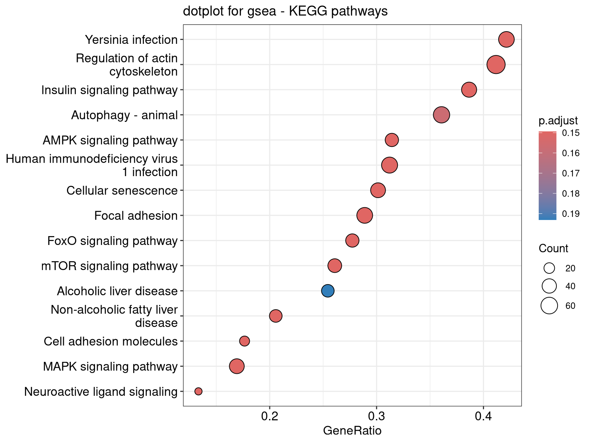
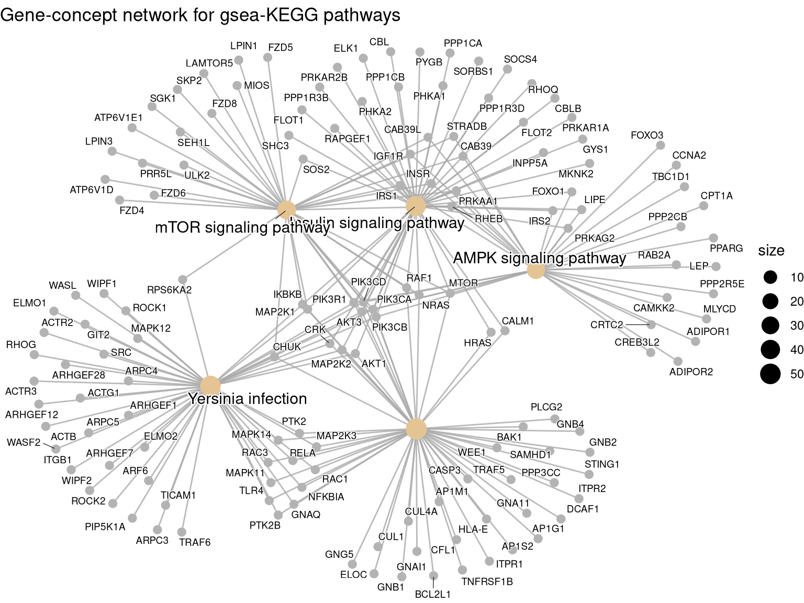

# **Pathway and enrichment analysis**

## **Downstream of DE gene analysis**

It is likely that you have a R object created for DE gene analysis, we will be loading DE gene results and conduct enrichment analyses. We will create a new R script called enrichment_script, under a new folder pathways:

1. Click "Files", "New Folder" and enter "pathways" for the folder name. 

2. Create an R script file to record the code that you will use for enrichment analysis: click "File" > "New File" > "R script". Click "File" > "Save"; save the file as "enrichment_script.R" under "pathway" (you might have to click pathway folder icon)


### **load packages**


``` r
suppressPackageStartupMessages({
library(DESeq2)
library(ggrepel)
library(clusterProfiler)
library(tidyverse)
library(enrichplot)
library(org.Hs.eg.db)
library(pathview)
})
```


### **Import previous DE results**

Create a output dir first, then read the DE gene results. 


``` r
outdir <- "./enrichment_res/"

dir.create(outdir, recursive=TRUE)

de_res <- read_tsv("DE_genes/deseq2_out_files/de_res.tsv")
```

### **How many DE genes**


``` r
## note the part after the "." sign is the version number, here we can just remove it.
de_res$ens_gene <- str_split_fixed(de_res$ens_gene, "\\.", 2)[, 1]

## check the first a few rows again
head(de_res)
```

```
## # A tibble: 6 × 10
##   ens_gene      Symbol Uniq_syms entrez Gene_name baseMean log2FoldChange  lfcSE
##   <chr>         <chr>  <chr>      <dbl> <chr>        <dbl>          <dbl>  <dbl>
## 1 ENSG00000152… SPARC… SPARCL1     8404 SPARC li…     994.          -4.54 0.210 
## 2 ENSG00000148… STOM   STOM        2040 stomatin    13368.          -1.41 0.0881
## 3 ENSG00000179… PER1   PER1        5187 period c…     764.          -3.13 0.204 
## 4 ENSG00000134… PHC2   PHC2        1912 polyhome…    2708.          -1.37 0.0902
## 5 ENSG00000120… DUSP1  DUSP1       1843 dual spe…    3357.          -2.90 0.198 
## 6 ENSG00000125… MT2A   MT2A        4502 metallot…    3627.          -2.17 0.150 
## # ℹ 2 more variables: pvalue <dbl>, padj <dbl>
```

``` r
fdr_cutoff <- 0.1
up_reg_genes <- de_res |>
  filter(padj < fdr_cutoff & log2FoldChange > 0 )  
down_reg_genes <- de_res |>
  filter(padj < fdr_cutoff & log2FoldChange < 0 )  

message("Number of up-regulated genes is: ", nrow(up_reg_genes))
```

```
## Number of up-regulated genes is: 1481
```

``` r
message("Number of down-regulated genes is: ", nrow(down_reg_genes))
```

```
## Number of down-regulated genes is: 1872
```

## **Why enrichment and pathway analysis?**

It can be difficult to look at so many genes, and sometimes a list of genes do not provide any biological insights. Enrichment and pathway analyses are performed to determine if there is any known biological functions, interactions or pathways in your DE gene studies. Generally speaking, Enrichment and pathway analyses are not restricted for DE gene expression, they can be performed on proteomics data, ChIP-seq, and genomic data as well. There are different algorithms for enrichment and pathway analyses. In this session, we will focus on two types: ORA (over representation analysis) and GSEA (gene set enrichment analysis).

## **ORA**

ORA explores whether there is enrichment of known biological functions or pathways in a particular set of genes (e.g. significantly up- or down-regulated genes). Gene ontology (GO) and KEGG (Kyoto Encyclopedia of Genes and Genomes) are two broadly used databases that are curated for exploring pathways and gene functions. GO is a framework used to represent and categorize gene functions across different species in a standardized manner. It provides a controlled vocabulary that describes genes in terms of their associated biological processes, cellular components, and molecular functions. The Gene Ontology Consortium maintains the GO vocabulary, as known as GO terms.

<details>
<summary>**Click to expand** More details on GO terms:</summary>

<blockquote>
To describe the roles of genes and gene products, GO terms are organized into three independent components in a species-independent manner:

1. Biological process: refers to the biological role involving the gene or gene product, and could include “transcription”, “signal transduction”, and “apoptosis”.  
2. Molecular function: represents the biochemical activity of the gene product, such activities could include “ligand”, “protein binding”, and “enzyme activity”.   
3. Cellular component: refers to the location in the cell of the gene product, such as “lysosome” and “plasma membrane”.  
    
The GO terms are loosely hierarchical, ranging from general, ‘parent’, terms to more specific, ‘child’ terms.

</blockquote>
</details>


In this session, we will be mostly using [clusterProfiler](https://guangchuangyu.github.io/software/clusterProfiler/) to conduct enrichment analyses.

In the ORA here, we will be testing whether 2 fold up-regulated (logfold-change = 1, as log fold change is often log2 based) genes are enriched in which GO terms. We will be using enrichGO function from clusterProfiler, and use the whole dataset (~20,000 genes) as the background (universe in enrichGO function).


``` r
## only getting DE genes at least have 2 fold change, so log2FC > 1, only up-regulated genes.
genes_2f_up <- de_res |>
  filter(padj < fdr_cutoff & log2FoldChange > 1)

message("Number of DE genes have at least 2 fold change is: ", nrow(genes_2f_up))
```

```
## Number of DE genes have at least 2 fold change is: 246
```

``` r
ego_BP <- enrichGO(gene          = as.character(genes_2f_up$entrez),
                universe      = as.character(de_res$entrez),
                OrgDb         = org.Hs.eg.db,
                ont           = "BP",
                pAdjustMethod = "BH",
                qvalueCutoff  = 0.05,
                keyType = "ENTREZID",
                readable = TRUE)
```

### **plot ORA results**

Dotplots can be used to depict the enrichment scores (e.g. p values) and gene count or ratio as circle size and colors. Cneplots, gene-concept network, allows us to know which genes are involved in these significant GO terms or pathways, as well as the linkages among GO terms or pathways.


``` r
dotplot(ego_BP, showCategory = 20, font.size = 9 ) + ggtitle("dotplot for ORA - BP")
```


``` r
cnetplot(ego_BP, showCategory = 10, node_label_size = 0.6, cex_label_category = 0.8,
  cex_label_gene = 0.5, cex_category = 0.8, cex_genes = 0.5, 
  max.overlaps = Inf) + ggtitle("Gene-concept network for ORA - GO:BP")
```


### **save ORA results to a tsv file** 
You can easily load this into Excel    

``` r
ego_BP_df <- ego_BP |>
  as.data.frame() 

## output the BP enrichment results into a tsv file
write_tsv(ego_BP_df, paste0(outdir, "/clusterProfiler_BP_res.tsv"))
```


<details>
<summary>**Click to expand** Exercise on your own:</summary>

<blockquote>
**Try to rerun the analyses: **    

1. Using the same conditions, return the enriched GO processes for the Molecular Function ontology.  

2. How would the enrichGO() function change if our organism was mouse?

</blockquote>
</details>


## **GSEA**
ORA is based on these differentially expressed genes. This approach will find genes where the difference is large and will fail where the difference is small, but evidenced in coordinated way in a set of related genes. [GSEA](https://www.pnas.org/doi/10.1073/pnas.0506580102) directly addresses this limitation. Unlike ORA where an arbitrary threshold is set as “significant DE genes”, all genes can be used in GSEA. We usually sort genes based on their fold changes or p-values, and compare this sorted gene list to a predefined gene set, such as genes in certain pathways. It will help to detect situations where all genes in a predefined set change in a small but coordinated manner. P-values are generated through permutation tests. This type of analysis can be particularly helpful if the differential expression analysis only outputs a small number of significant DE genes.

Here, what we create is a sorted list of all genes (~20,000 genes) in our dataset sorted by -log10(pvalue) and sign of fold change; this way, up-regulated and down-regulated genes will be at the top and bottom of the list. In GSEA, we will show how to run GSEA on [KEGG pathways](https://www.genome.jp/kegg/pathway.html)


``` r
## we will use all the genes. Get the fold change and pvalues.
gene_list <- sign(de_res$log2FoldChange) * -log10(de_res$pvalue)
## or we can just use fold change data. 

## get the name of the genes. 
names(gene_list) <- de_res$entrez ## the names of the gene list is the en ID. 

## remove NA is there is any in the fold change or gene names
if(any(is.na(gene_list))){ 
  gene_list = gene_list[-which(is.na(gene_list))]
}
if(any(is.na(names(gene_list)))) {
  gene_list = gene_list[-which(is.na(names(gene_list)))]
}

## also remove duplicated gene names
gene_list <- gene_list[!duplicated(names(gene_list))]

## sort from largest to smallest.
gene_list <- sort(gene_list, decreasing = TRUE)

head(gene_list)
```

```
##   115207     6536     9181   165215   338382     1277 
## 43.56579 42.34242 32.18764 31.64835 29.16647 28.73637
```

``` r
# set seeds
set.seed(1234)

## run GSEA using clusterProfiler
gseaKEGG <- gseKEGG(geneList = gene_list, # ordered named vector of fold changes (Entrez IDs are the associated names)
              organism = "hsa", 
              nPerm = 1000, # default number permutations
              minGSSize = 100, # minimum gene set size (# genes in set) - change to test more sets or recover sets with fewer # genes
              pvalueCutoff = Inf, # padj cutoff value
              verbose = FALSE, 
              eps = 0)
```

```
## Reading KEGG annotation online: "https://rest.kegg.jp/link/hsa/pathway"...
```

```
## Reading KEGG annotation online: "https://rest.kegg.jp/list/pathway/hsa"...
```

``` r
gseaKEGG_gene_symbol <- setReadable(gseaKEGG, 'org.Hs.eg.db', 'ENTREZID')
```

### **save gsea results** 

``` r
# gsea is a large list, and we convert it to a data frame, and save the results
gsea_df <- gseaKEGG_gene_symbol |> as.data.frame()

write_tsv(gsea_df, paste0(outdir, "/clusterProfiler_KEGG_GSEA_res.tsv"))
```


### **plot GSEA results**

Similarity, we can make dotplot and gene-concept network plots here.


``` r
# first dotplot
dotplot(gseaKEGG_gene_symbol, showCategory = 15) + ggtitle("dotplot for gsea - KEGG pathways")
```



``` r
cnetplot(gseaKEGG_gene_symbol, 
         showCategory = 5, 
         node_label_size = 0.6, 
         cex_label_category = 0.8,
         cex_label_gene = 0.5, 
         cex_category = 0.8, cex_genes = 0.5, 
         max.overlaps = Inf) + ggtitle("Gene-concept network for gsea-KEGG pathways")
```



``` r
# Specific plots we can make for GSEA results
gseaplot(gseaKEGG_gene_symbol, geneSetID = 'hsa04910')
```


### **plot KEGG map**


``` r
# Lastly, we can map gene expression to a KEGG map
foldchanges <- de_res$log2FoldChange
names(foldchanges) <- de_res$entrez

pathview(gene.data = foldchanges,
              pathway.id = 'hsa04910',
              species = "hsa",
              limit = list(gene = 2, # value gives the max/min limit for foldchanges
              cpd = 1), 
              low=list(gene="steelblue"),
              high=list(gene="gold"))
## you can download the map from Rstudio, and you will be seeing something like this. 
```


## **Other R packages and tools**   

We introduced a few commonly used R packages to conduct enrichment and pathway analyses. Other popular tools and R packages include:  
- [g:Profiler](https://biit.cs.ut.ee/gprofiler/gost): a web based toolfor functional profiling of gene or protein lists.  
- [gprofiler2](https://cran.r-project.org/web/packages/gprofiler2/vignettes/gprofiler2.html), an R interface (package) to the widely used web toolset g:Profiler.  
- [Revigo](http://revigo.irb.hr/): if you have a long list Gene Ontology terms, Revigo can nd summarize them by removing redundant GO terms.    
- [aPear](https://cran.r-project.org/web/packages/aPEAR/vignettes/aPEAR-vignette.html): generate an enrichment network from enrichment results, works seamlessly with clusterProfiler.    
- [cytospace](https://cytoscape.org/): an open source software platform for visualizing complex networks. Cytospace offer many apps (formerly known as plugins) to extends its functionalities, and see [here](https://cytoscape.org/cytoscape-tutorials/protocols/enrichmentmap-pipeline/#/) for a workflow of how to visualize omics data using Cytospace and its apps. 

